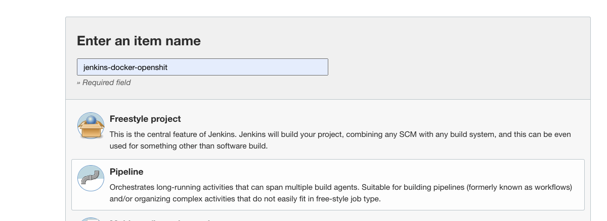
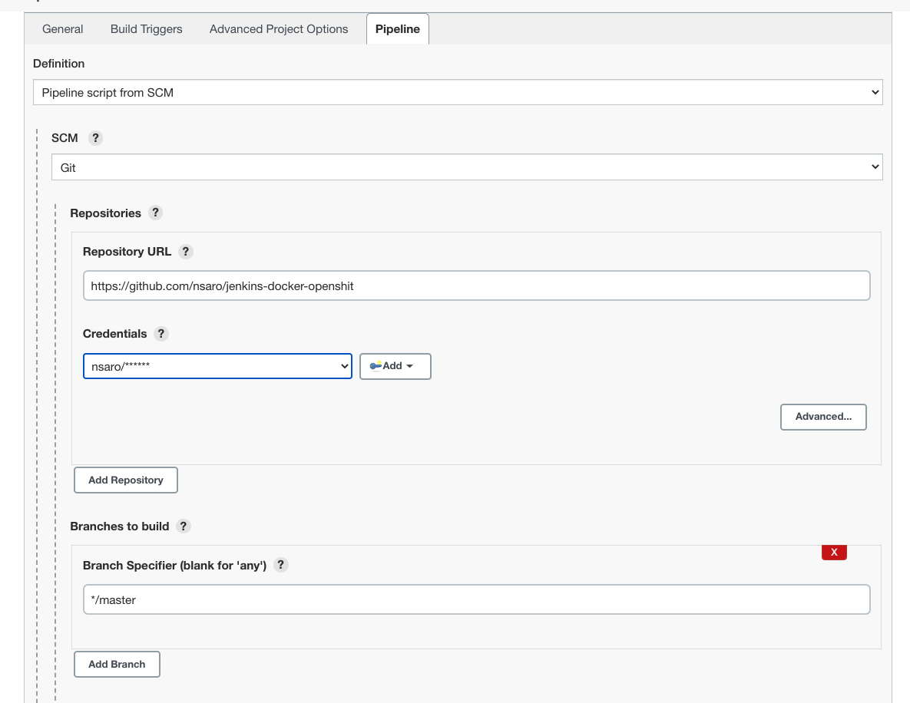
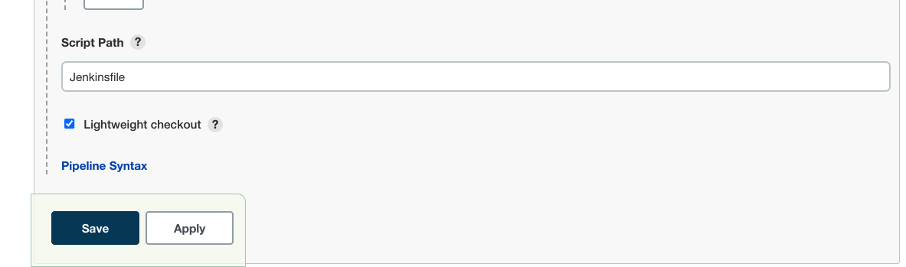
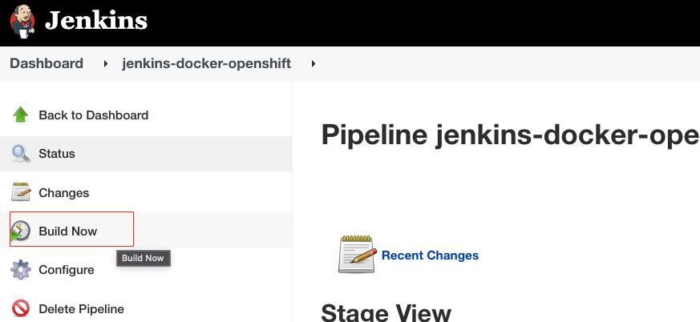
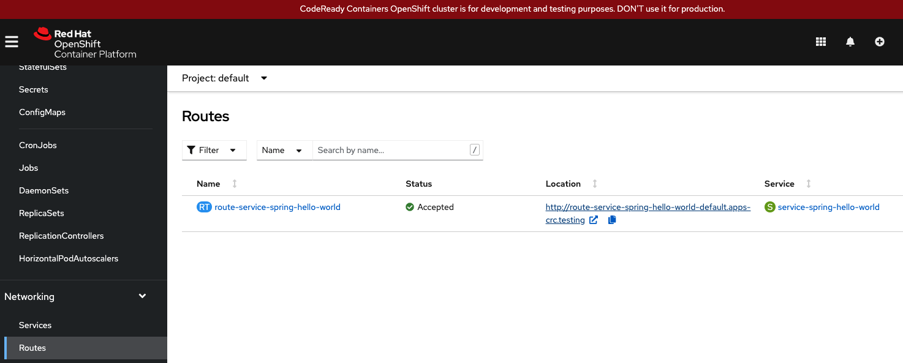

# Springboot, Jenkins and Openshift Skills
This project demonstrate deplying a simple Springboot Hello World application on Openshift cluster using Jenkins pipeline.

Prerequisite

- Local Openshift Installation : https://www.youtube.com/watch?v=3W4sGFHRgAQ&t=209s
- Local Jenkins Installation : https://www.jenkins.io/doc/book/installing/macos/

In jenkins dashboard, create a new item of type **Pipeline**.

In pipeline configuration window, update the section in Pipeline tab as below. Dont forget to add Github credentials for smooth access to Github repository

The pipe job configuration is picked from the Jenkinsfile of the project. Save the project

- Make sure, your openshift code ready container is working and logged in as administrator.
Click on Build Now.

After the pipeline success, you should see the below entry in Routes page of Openshift instance

You should be able to see the application running on
http://route-service-spring-hello-world-default.apps-crc.testing/
